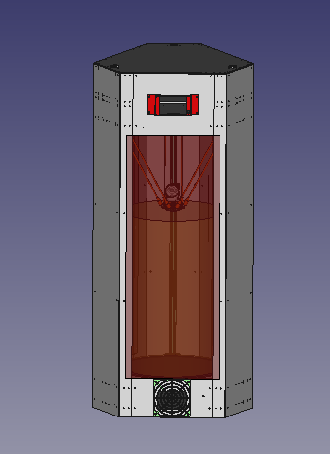
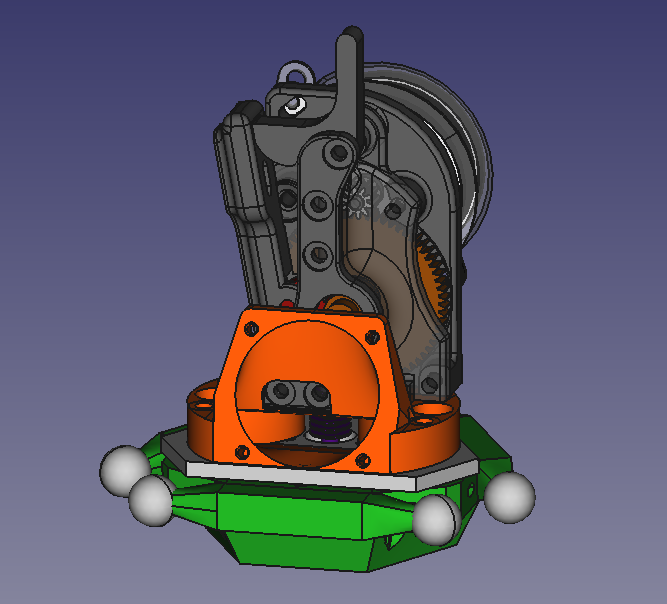
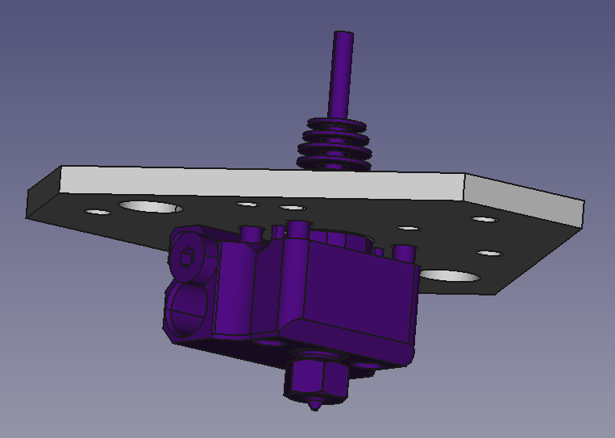
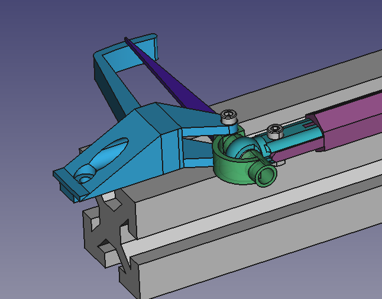

# Titanic_Delta
 Intermediate size delta aimed to print fast and made to be cheap

# Features

- Build Volume: 300x500mm
- Lightweight direct drive hotend
- Rigid frame
- Closed volume
- Laser cut metal plates
- Zero-backlash ball joint
- Shorest possible length between nozzle and extruder
- Integrated filament dryer section

## Extruder

Heater block is mounted to the [effector](CAD/kinematics/effector_ver_7.FCstd)

## Arm calibration tool

